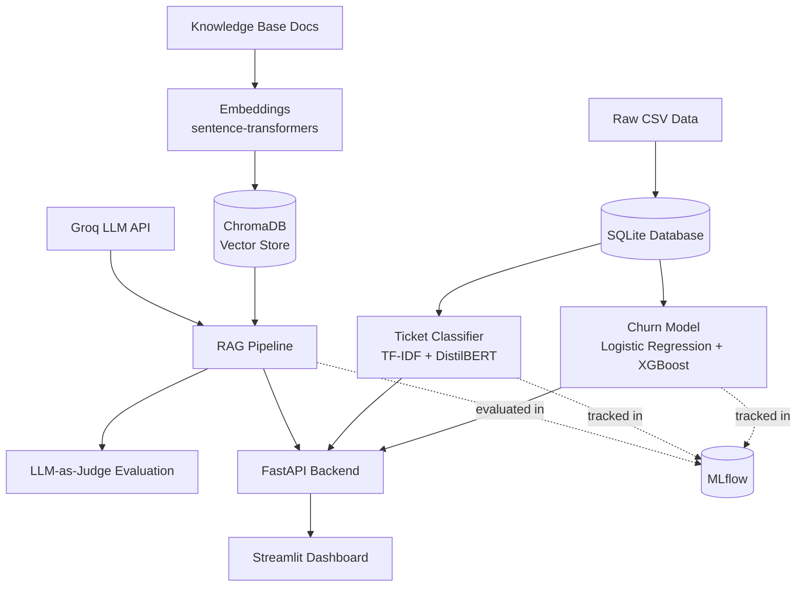

<div align="center">

# 📊 InsightHub

### An End-to-End AI/ML Platform — From Raw Data to Production

**Classical Machine Learning · Deep Learning/NLP · Generative AI (RAG) · MLOps · Full-Stack Deployment**

[](https://insightapp-d6sir4vdna7rgv9blw5qmz.streamlit.app/)
[](https://www.python.org/)
[]()
[]()
[]()

**[🔗 Try the live app →](https://insightapp-d6sir4vdna7rgv9blw5qmz.streamlit.app/)**

</div>

---

## Overview

InsightHub is a customer intelligence platform for a fictional e-commerce company, built to demonstrate the complete modern **AI Engineer / Data Scientist** toolkit — not as three disconnected demos, but as one coherent, production-shaped system spanning the full lifecycle: data engineering → model training → experiment tracking → evaluation → API serving → containerization → CI/CD → cloud deployment.

It answers three real business questions:

| | |
|---|---|
| 📉 **Will this customer churn?** | XGBoost + Logistic Regression trained on account/usage data, compared and tracked in MLflow |
| 🎫 **What category is this support ticket?** | NLP model comparing a TF-IDF baseline against a fine-tuned DistilBERT transformer |
| 💬 **Can customers get accurate answers instantly?** | A RAG chatbot grounded in real company policy docs — with a quantified evaluation suite, not just vibes |

---

## Live Demo

**🔗 [insightapp-d6sir4vdna7rgv9blw5qmz.streamlit.app](https://insightapp-d6sir4vdna7rgv9blw5qmz.streamlit.app/)**

The deployed app includes all three tools in one multi-page dashboard:
- **Churn Prediction** — fill in a customer's details, get a live risk score
- **Ticket Classifier** — paste a support ticket, see it auto-categorized with confidence scores
- **Support Chat** — ask real questions about shipping/returns/billing, grounded in actual policy documents

---

## Why This Project

Most portfolio projects are a single model in a notebook. InsightHub is deliberately built the way a real ML platform team works:

- ✅ **Multiple models compared, not just one trained** — every model has a documented baseline it had to beat
- ✅ **Every experiment tracked** — MLflow logs params/metrics for every training run, not just the final one
- ✅ **Evaluated, not just eyeballed** — the RAG chatbot has a golden dataset + LLM-as-judge evaluation suite measuring retrieval accuracy, faithfulness, and hallucination resistance
- ✅ **Served two ways** — a Streamlit UI for demos, and a documented REST API (FastAPI) for integration into other systems
- ✅ **Reproducible** — containerized with Docker, dependency-locked with `uv`, tested via GitHub Actions CI on every push

---

## Architecture



**Two ways to consume the models:**
- **Streamlit dashboard** *(what's live above)* — models loaded directly, optimized for demoing
- **FastAPI backend** — documented REST endpoints (`/predict/churn`, `/classify/ticket`, `/chat`), optimized for integration into other systems

Both are containerized with Docker and orchestrated together via `docker-compose`.

---

## Tech Stack

<table>
<tr><td><b>Data</b></td><td>Pandas, SQLite, SQLAlchemy</td></tr>
<tr><td><b>Classical ML</b></td><td>scikit-learn, XGBoost</td></tr>
<tr><td><b>Deep Learning / NLP</b></td><td>PyTorch, HuggingFace Transformers (fine-tuned DistilBERT)</td></tr>
<tr><td><b>GenAI / RAG</b></td><td>sentence-transformers, ChromaDB, Groq (LLM inference)</td></tr>
<tr><td><b>Evaluation</b></td><td>Custom golden dataset + LLM-as-judge scoring (faithfulness, relevance, refusal accuracy)</td></tr>
<tr><td><b>Experiment Tracking</b></td><td>MLflow (SQLite backend)</td></tr>
<tr><td><b>Serving</b></td><td>FastAPI, Pydantic, Uvicorn</td></tr>
<tr><td><b>Frontend</b></td><td>Streamlit (multi-page app)</td></tr>
<tr><td><b>Containerization</b></td><td>Docker, docker-compose</td></tr>
<tr><td><b>CI/CD</b></td><td>GitHub Actions</td></tr>
<tr><td><b>Environment</b></td><td>uv (dependency + venv management)</td></tr>
</table>

---

## Results

### 📉 Churn Prediction
Two models trained, evaluated with stratified cross-validation, and compared via MLflow — evaluated on ROC-AUC and F1 rather than plain accuracy, since the churn classes are imbalanced:

| Model | ROC-AUC | F1 (churn class) |
|---|:---:|:---:|
| Logistic Regression | 0.841 | 0.613 |
| **XGBoost** ✅ *(selected)* | **0.843** | **0.635** |

Both models use class weighting to deliberately prioritize **recall over precision** — in a churn use case, failing to flag a real churner is costlier than a false alarm that gets reviewed and dismissed.

### 🎫 Ticket Classification
A classical baseline compared against a fine-tuned transformer:

| Model | Approach |
|---|---|
| TF-IDF + Logistic Regression | Baseline — word-frequency features, no deep learning |
| Fine-tuned DistilBERT | Transfer learning on pretrained transformer weights |

*Full metrics tracked in MLflow's `ticket_classification` experiment.*

### 💬 RAG Chatbot Evaluation
Unlike most portfolio RAG demos, this one is quantitatively evaluated against a 16-case golden dataset spanning all three policy documents plus deliberately out-of-scope questions:

| Metric | What it measures |
|---|---|
| **Retrieval Hit Rate** | Did the correct source document get retrieved for in-scope questions? |
| **Faithfulness (1-5)** | LLM-as-judge score: did the answer stick to retrieved context, or hallucinate? |
| **Relevance (1-5)** | LLM-as-judge score: did the answer actually address the question? |
| **Refusal Accuracy** | For out-of-scope questions, did it correctly decline instead of making something up? |

*See MLflow's `rag_evaluation` experiment for current scores.*

---

## Project Structure

```
insight-hub/
├── app.py                          # Streamlit landing page
├── pages/                          # Streamlit multi-page app
│   ├── 1_Churn_Prediction.py
│   ├── 2_Ticket_Classifier.py
│   └── 3_Support_Chat.py
├── src/
│   ├── ingestion/                   # Data loading (ETL) scripts
│   ├── models/                      # Model training scripts
│   ├── rag/                         # RAG pipeline + evaluation suite
│   └── api/                         # FastAPI backend
├── data/
│   ├── raw/                         # Source CSVs (gitignored)
│   ├── knowledge_base/              # RAG source documents
│   ├── eval/                        # Golden dataset + eval results
│   └── processed/                   # Databases, trained models, vector store
├── notebooks/                       # Exploratory data analysis
├── Dockerfile                       # API container
├── Dockerfile.streamlit             # Frontend container
├── docker-compose.yml
└── .github/workflows/ci.yml         # CI pipeline
```

---

## Running It Locally

### 1. Setup
```bash
git clone https://github.com/<your-username>/insighthub.git
cd insighthub
uv sync
```

Create a `.env` file:
```
GROQ_API_KEY=your_key_here
```

### 2. Build the data pipeline
```bash
uv run python src/ingestion/load_data.py
uv run python src/ingestion/load_tickets.py
uv run python src/rag/ingest_knowledge_base.py
```

### 3. Train the models
```bash
uv run python src/models/train_and_compare.py            # churn (LogReg + XGBoost)
uv run python src/models/train_ticket_baseline.py         # ticket classifier (TF-IDF)
uv run python src/models/train_ticket_transformer_v2.py   # ticket classifier (DistilBERT)
```

### 4. Evaluate the RAG chatbot
```bash
uv run python src/rag/evaluate_rag.py
```

### 5. Run the app
```bash
uv run streamlit run app.py              # Streamlit dashboard
uv run fastapi dev src/api/main.py       # OR the REST API
docker compose up                         # OR both, containerized
```

### 6. View experiment tracking
```bash
uv run mlflow ui
```

---

## What I'd Improve With More Time

- Train the DistilBERT classifier on the full dataset with GPU access (current results are from a CPU-constrained subset, documented honestly rather than hidden)
- Expand the RAG evaluation suite with RAGAS for standardized context precision/recall metrics
- Add automated regression tests for LLM behavior in CI (guardrail tests that fail the build if faithfulness drops)
- Add a feature store and automated retraining pipeline
- Add authentication and rate limiting to the FastAPI backend
- Add production monitoring / data drift detection

---

<div align="center">

**Built end-to-end — from a raw CSV to a live, evaluated, deployed AI product.**

[Live Demo](https://insightapp-d6sir4vdna7rgv9blw5qmz.streamlit.app/) · [Report an Issue](../../issues)

</div>
